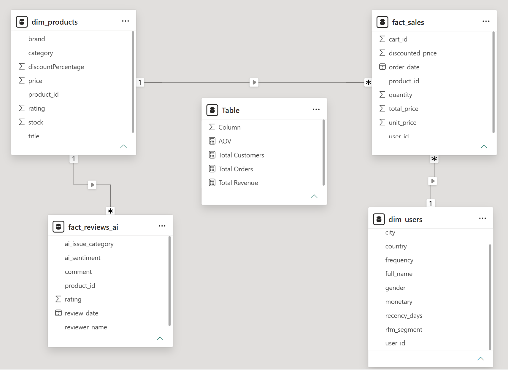
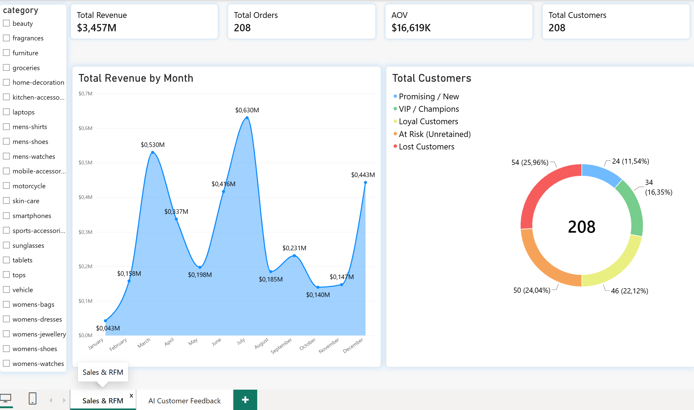
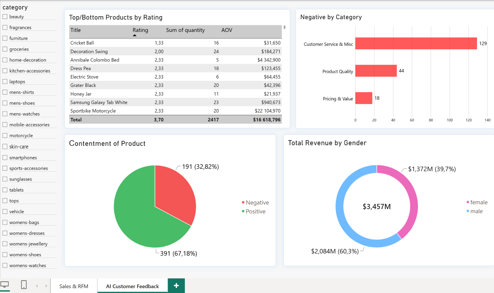

# E-Commerce-Analytics
Від сирих API-даних до дашборду в Power BI з NLP аналітикою відгуків

Привіт! Це мій комплексний аналітичний пет-проєкт. Його головна ідея — показати, як можна не просто вивести базові метрики продажів (скільки продали і на яку суму), але й пов'язати їх із клієнтським досвідом (чому люди йдуть і на що скаржаться). 

У цьому проєкті я пройшов повний пайплайн дата-аналітика: від вивантаження брудних даних по API та їх обробки в Python до побудови моделі даних у Power BI та формулювання бізнес-висновків.

## 🛠 Технічний стек
* **Python (Pandas, Requests, JSON, Text Mining)** — збір, очищення даних та rule-based категоризація текстових відгуків (NLP-евристика).
* **Power BI & DAX** — побудова моделі даних, розрахунок метрик, візуалізація.

---

## Етап 1: Збір та підготовка даних (Python & Pandas)

Усе почалося з вивантаження даних із CRM/інтернет-магазину через REST API. 
1. **Робота з API:** Я написав скрипт на Python з використанням бібліотеки `requests`, який пагіновано витягував таблиці `Orders`, `Customers`, `Products` та `Reviews`. Дані приходили у вкладених JSON-ах, тому довелося повозитися з `pd.json_normalize()`, щоб розгорнути їх у пласкі таблиці.
2. **Очищення даних (Pandas):** 
   * Обробив пропуски: десь не було дат (заповнював логічними інтервалами або дропав, якщо відновити неможливо), привів стовпці до потрібних типів (`pd.to_datetime`, числові формати для цін).
   * Почистив дублікати транзакцій та уніфікував назви категорій товарів (прибрав різний регістр та друкарські помилки).
3. **Text Mining та категоризація відгуків:** написав власний rule-based класифікатор на Python (`apply` + `lambda` функції в Pandas). Він аналізує рейтинг товару та шукає семантичні тригери (ключові слова) у текстах відгуків. Залежно від знайдених маркерів (наприклад, 'broken', 'delay', 'expensive'), скрипт автоматично присвоює відгуку тональність (Sentiment) Positive / Negative.
   * **Категорія проблеми:** Якщо відгук негативний, модель тегувала його (Customer Service, Product Quality, Pricing & Value).
5. **Вивантаження:** Чисті та збагачені датафрейми я експортував у кілька `CSV`-файлів, щоб вони стали легкими та готовими для імпорту в BI-систему.

---

## Етап 2: Моделювання в Power BI

Завантаживши CSV-файли в Power BI, я не став просто ліпити графіки на пласких таблицях, а побудував класичну схему «Зірка» (Star Schema).

* **Таблиці фактів (Fact Tables):** `Fact_Orders` (інформація про транзакції) та `Fact_Reviews` (відгуки).
* **Таблиці вимірів (Dim Tables):** `Dim_Customers`, `Dim_Products`, і окрема таблиця `Calendar` (Date Table) для коректного розрахунку Time Intelligence метрик (YTD, динаміка за місяцями).
* Зв'язки налаштував переважно як `1-to-Many` (один до багатьох) із суворою односпрямованою фільтрацією, щоб уникнути циклів та падіння продуктивності.

Далі за допомогою **DAX** я розрахував ключові міри: `Total Revenue`, `Total Orders`, `AOV` (Середній чек) і написав логіку для розбивки клієнтів по RFM-сегментах прямо всередині моделі.

---

## Етап 3: Структура дашборду та метрики

Я розділив звіт на дві сторінки, щоб розділити бізнес-логіку: зверху вниз.

### Сторінка 1: Sales & RFM (Продажі та Лояльність)
Тут ми дивимося на здоров'я бізнесу в цілому.
* **Картки KPI:** Виведено головні цифри. Total Revenue ($3.457M), Кількість замовлень (208) та Середній чек (AOV $16.6K).
* **Total Revenue by Month:** Графік динаміки із заливкою. Чітко видно піки продажів (липень — $0.630M, березень — $0.530M) і сильні просадки в осінні місяці.
* **Total Customers (RFM-аналіз):** Кільцева діаграма сегментації бази. Я розділив 208 клієнтів на когорти: VIP, Loyal, Promising, At Risk, Lost. Зеленим виділив "чемпіонів", а червоним — втрачених, щоб одразу впадало в око.

### Сторінка 2: AI Customer Feedback (Глибокий аналіз проблем)
Тут ми шукаємо причини того, чому клієнти відвалюються. Я пов'язав гроші з відгуками.
* **Top/Bottom Products by Rating:** Зведена таблиця, де товари відсортовані за спаданням рейтингу (від 1.33 до 5.0). Я додав туди колонки `Sum of quantity` та `AOV`. Це дозволяє бачити не просто "погані товари", а *погані товари, які ми багато продаємо*.
* **Negative by Category:** Лінійчаста діаграма, побудована на тих самих даних з Python. Показує розподіл негативу.
* **Contentment of Product:** Загальне співвідношення позитиву (67%) і негативу (32%).
* **Total Revenue by Gender:** Частка виторгу за статтю, де видно, що чоловіки (Male) генерують 60.3% ($2.084M) від усієї каси.

---

## 📈 Ключові висновки (Business Insights)

Покрутивши готовий дашборд, я сформував такі інсайти для потенційного замовника/керівника:

1. **Діра в клієнтському сервісі:** Графік "Negative by Category" ламає стереотип про те, що "людям дорого". З усього негативу на "Pricing & Value" скаржаться лише 18 разів, тоді як на "Customer Service" — 129 разів. Бізнес втрачає лояльність через погану підтримку чи доставку, а не через ціни. Цю зону потрібно масштабно реформувати.
2. **Критичний рівень відтоку:** На сторінці RFM видно, що сегмент "Lost Customers" (25.96%) — найбільший, плюс ще 11.5% перебувають "At Risk". Майже 40% бази йде. З огляду на пункт 1, маркетинг зараз просто ллє воду в діряве відро.
3. **Токсичні товари в топі продажів:** У таблиці аутсайдерів видно, що такі товари як *Decoration Swing* (рейтинг 2.00) або *Sportbike Motorcycle* (рейтинг 2.33) продаються у великих кількостях (24 і 20 штук) і генерують величезний виторг (сотні тисяч $). Продаючи їх з такою поганою якістю, компанія своїми ж руками вбиває LTV (Lifetime Value) клієнтів. Їх потрібно терміново або знімати з вітрини, або міняти постачальника.
4. **Фокус на чоловічу аудиторію:** Чоловіки генерують 60% виторгу. При формуванні майбутніх рекламних кампаній та закупівлі асортименту варто робити більший акцент на цю демографію для максимізації ROAS.

---
